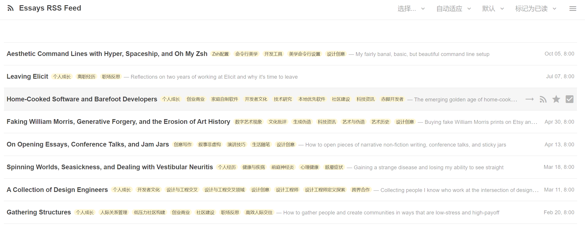

# TTRSS OpenAI Auto Labels Plugin

[English](README.md)  | [中文](README_zh.md)



Automatically label your Tiny Tiny RSS articles using OpenAI's GPT models. This plugin analyzes article content and suggests relevant labels based on existing tags and content analysis.

## Features

- 🤖 Automatic article labeling using OpenAI API
- 🏷️ Smart reuse of existing labels
- ~~🎨 Automatic color generation for new labels~~
- 🌍 Configurable label language
- 🔄 Customizable number of labels per article (1-10)
- ⚡ Configurable API endpoint and model selection
- 📝 Adjustable content length for analysis (500-4000 characters)
- 🎯 Comprehensive error handling and logging

**Warning:** Automatic color generation for new labels is temporarily unavailable. For some reason, the functionality code is not working as intended. If you are interested in resolving this issue, contributions to the code are welcome!

## Requirements

- Tiny Tiny RSS v21.0.0 or higher

## Installation

1. Download the latest release from GitHub
2. Extract the `openai_auto_labels` folder to your TTRSS plugins directory:
   ```bash
   cd /path/to/ttrss/plugins
   git clone https://github.com/fangd123/ttrss-openai-auto-labels.git openai_auto_labels
   ```
3. Enable the plugin in TTRSS Preferences -> Plugins
4. Configure your OpenAI API key in Preferences -> Feeds -> Plugins -> OpenAI Auto Labels Settings

## Configuration

1. Go to Preferences -> Feeds -> OpenAI Auto Labels Settings
2. Enter your OpenAI API key
3. Configure your preferences:
   - Label language (defaults to your TTRSS system language)
     - Use standard language codes like 'en', 'zh-CN', etc.
     - If your TTRSS system language is set to 'auto', English will be used
   - OpenAI API endpoint (defaults to official API)
   - GPT model selection (defaults to gpt-4o-mini)
   - Maximum number of labels per article (1-10, default: 5)
   - Maximum text length for analysis (500-4000 characters, default: 1500)

## How It Works

1. When a new article is received, the plugin extracts the title and content
2. Content is truncated to the configured length (default: 1500 characters) to optimize API usage
3. The plugin retrieves existing labels from your TTRSS installation
4. The configured OpenAI model analyzes the content and suggests relevant labels
5. Labels are either reused from existing ones or created as new
6. New labels get automatically assigned contrasting colors
7. The specified number of most relevant labels are applied to the article

## Error Handling

The plugin includes comprehensive error handling for various scenarios:

- Network connectivity issues
- API key validation
- Rate limiting
- Quota management
- Response parsing
- Timeout handling

Errors are logged to TTRSS's logging system for troubleshooting.

## Contributing

Contributions are welcome! Please feel free to submit a Pull Request.

1. Fork the repository
2. Create your feature branch (`git checkout -b feature/amazing-feature`)
3. Commit your changes (`git commit -m 'Add some amazing feature'`)
4. Push to the branch (`git push origin feature/amazing-feature`)
5. Open a Pull Request

## License

This project is licensed under the MIT License - see the [LICENSE](LICENSE) file for details.

## Author

**fangd123** - [GitHub Profile](https://github.com/fangd123)

## Acknowledgments

- Thanks to the TTRSS community
- Built using OpenAI's GPT API
- Inspired by the need for better article organization

## Support

If you encounter any issues or have questions, please:

1. Check the [Issues](https://github.com/fangd123/ttrss-openai-auto-labels/issues) page
2. Create a new issue if your problem isn't already listed
3. Provide as much detail as possible, including:
   - TTRSS version
   - PHP version
   - Error messages
   - Steps to reproduce