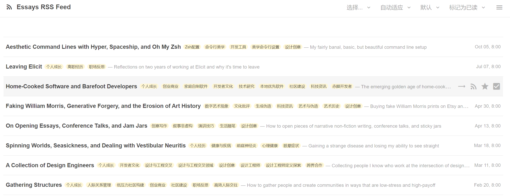

# TTRSS OpenAI 自动标签插件

[English](README.md) | [中文](README_zh.md)



使用 OpenAI 的 GPT 模型为您的 Tiny Tiny RSS 文章自动添加标签。该插件通过分析文章内容，基于现有标签和内容分析来推荐相关标签。

## 功能特点

- 🤖 使用 OpenAI API 进行自动文章标签
- 🏷️ 智能复用现有标签
- ~~🎨 为新标签自动生成颜色~~
- 🌍 可配置标签语言
- 🔄 可自定义每篇文章的标签数量（1-10个）
- ⚡ 可配置 API 接入点和模型选择
- 📝 可调整分析内容长度（500-4000字符）
- 🎯 全面的错误处理和日志记录

**提醒：** 新标签的自动颜色生成功能暂时不可用。由于某些原因，相关功能代码未能按预期工作。如果您有兴趣解决这个问题，欢迎为代码做出贡献！

## 系统要求

- Tiny Tiny RSS v21.0.0 或更高版本

## 安装方法

1. 从 GitHub 下载最新版本
2. 将 `openai_auto_labels` 文件夹解压到您的 TTRSS 插件目录：
   ```bash
   cd /path/to/ttrss/plugins
   git clone https://github.com/fangd123/ttrss-openai-auto-labels.git openai_auto_labels
   ```
3. 在 TTRSS 偏好设置 -> 插件 中启用该插件
4. 在 偏好设置 -> 订阅源 -> 插件 -> OpenAI 自动标签设置 中配置您的 OpenAI API 密钥

## 配置说明

1. 转到 偏好设置 -> 订阅源 -> OpenAI 自动标签设置
2. 输入您的 OpenAI API 密钥
3. 配置您的偏好设置：
   - 标签语言（默认使用您的 TTRSS 系统语言）
     - 使用标准语言代码，如 'en'、'zh-CN' 等
     - 如果您的 TTRSS 系统语言设置为 'auto'，将使用英语
   - OpenAI API 接入点（默认为官方 API）
   - GPT 模型选择（默认为 gpt-4o-mini）
   - 每篇文章的最大标签数量（1-10个，默认：5个）
   - 分析的最大文本长度（500-4000字符，默认：1500字符）

## 工作原理

1. 当收到新文章时，插件提取标题和内容
2. 内容会被截断到配置的长度（默认：1500字符）以优化 API 使用
3. 插件从您的 TTRSS 安装中获取现有标签
4. 配置的 OpenAI 模型分析内容并推荐相关标签
5. 标签要么从现有标签中复用，要么创建为新标签
6. 新标签会自动分配对比色
7. 将指定数量的最相关标签应用到文章上

## 错误处理

插件包含对各种情况的全面错误处理：

- 网络连接问题
- API 密钥验证
- 速率限制
- 配额管理
- 响应解析
- 超时处理

错误会被记录到 TTRSS 的日志系统中以便排查。

## 贡献指南

欢迎贡献！请随时提交拉取请求。

1. Fork 本仓库
2. 创建您的特性分支（`git checkout -b feature/amazing-feature`）
3. 提交您的更改（`git commit -m '添加某个很棒的特性'`）
4. 推送到分支（`git push origin feature/amazing-feature`）
5. 开启一个拉取请求

## 许可证

本项目采用 MIT 许可证 - 查看 [LICENSE](LICENSE) 文件了解详情。

## 作者

**fangd123** - [GitHub 主页](https://github.com/fangd123)

## 致谢

- 感谢 TTRSS 社区
- 使用 OpenAI 的 GPT API 构建
- 源于对更好的文章组织方式的需求

## 支持

如果您遇到任何问题或有疑问，请：

1. 查看[问题](https://github.com/fangd123/ttrss-openai-auto-labels/issues)页面
2. 如果您的问题尚未列出，创建一个新的问题
3. 提供尽可能多的细节，包括：
   - TTRSS 版本
   - PHP 版本
   - 错误信息
   - 复现步骤